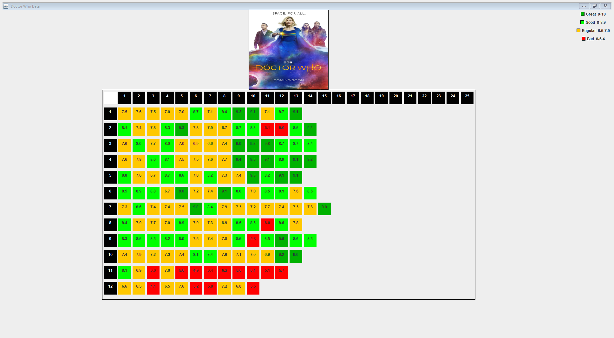

# Fun-Side-Projects
This repository holds projects that felt like would be fun to try and make.

**Project 1** This shows a visualization of of a tv-series ratings per episode by accessing data using the imdb api through rapid api.

For example, as input, the user puts Doctor Who. The output would be the following:

